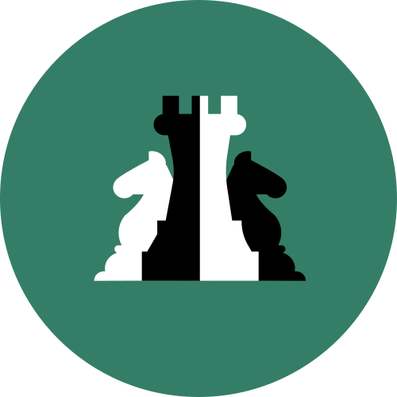

<p align="center">
  
</p>

# LeyReal API — Architecture Showcase

[](LICENSE)

A public reference build of **LeyReal's** paid API — adapted from the real,
private implementation ([leyreal-system](https://github.com/Artificialss/leyreal-system))
to show its architecture, endpoint contracts, and the opaque-id scheme,
without carrying over any database access, real credentials, or the actual
~99,858-record Costa Rican law corpus.

Browse the code, clone it, run it locally against the example responses —
no setup beyond `cargo run` needed. There is no database here.

## What's real

- **The opaque-id scheme** (`src/opaque_id.rs`), byte for byte: HKDF-SHA256
  derives a per-key cipher key from the raw API key + a stored salt, an
  8-round Feistel network runs that key as a keyed bijection over the
  64-bit id space, and the result is base62-encoded. It's reversible with
  the same raw key, needs no id-mapping table, and a leak of the stored
  salt alone reveals nothing. Unit-tested here for round-tripping and
  per-key distinctness -- run `cargo test`.
- **The endpoint shapes and request contracts** below, including the
  paid-only gate and the one free endpoint's reasoning.
- **The Vercel Rust runtime pattern** (`vercel_runtime` + one binary per
  endpoint), matching [cryptoally-api](https://github.com/Artificialss/cryptoally-api).

## What's deliberately left out

- **No database.** `src/auth.rs` and `src/norms.rs` here are demo
  versions: `authenticate_demo` accepts any non-empty Bearer token instead
  of checking a real `api_keys` table, and every endpoint returns one
  fixed example record instead of querying Postgres. The real versions of
  both files (leyreal-system, private) are structurally identical but
  actually hit Neon.
- **No credentials of any kind.** No `.env`, no connection strings, no
  real key hashes.
- **No real corpus data.** Every response is the same clearly-labeled
  example law, regardless of what you query for.
- **No quota enforcement, no canary/scrape-detection logging** (both are
  real, DB-backed features in the private version).

## Endpoints

Three list endpoints, a detail endpoint, and one free status check. The
real API paginates list endpoints at 5 results/page with a hard 10-page
ceiling (50 rows max reachable per distinct query) — deliberately tight,
so a scraper has to issue many distinctly-scoped queries to reach the
whole corpus rather than just paging through one. All but `status`
require `Authorization: Bearer <key>` in the real API, and the key must
be tier `paid` — there is no customer-facing free tier.

```
GET /api/v1/norms/search?q=<title text>&page=
GET /api/v1/norms/by-number?number=<law number>
GET /api/v1/norms/by-subject?subject=<classification name>&page=
GET /api/v1/norms/:id
GET /api/v1/norms/status?number=<law number>   # free, no key
```

`status` is free and needs no key for a structural reason, not just a
pricing one: every other endpoint's `id` is opaque *per API key* (see
above) — there's no key to derive or decode an opaque id without, so a
truly public endpoint has to work by plain law number instead. Checking
whether a law is currently in force is public-interest information; full
text is the paid product.

## Try it

```sh
cargo run --release --bin search
# in another shell:
curl "http://localhost:3000/?q=trabajo" -H "Authorization: Bearer demo-anything"
curl "http://localhost:3000/?q=trabajo"   # 401 -- no key at all still fails here
```

`vercel_runtime`'s `run()` starts its own local server (port 3000 by
default), so run one binary at a time.

## About Artificialss

[Artificialss](https://artificialss.ai/) is an applied AI research and
product lab building software with measurable social benefit and a
transparent ecological footprint. Software & AI Ethical Labs, headquartered
in Turrialba, Costa Rica. Contact: info@artificialss.ai
